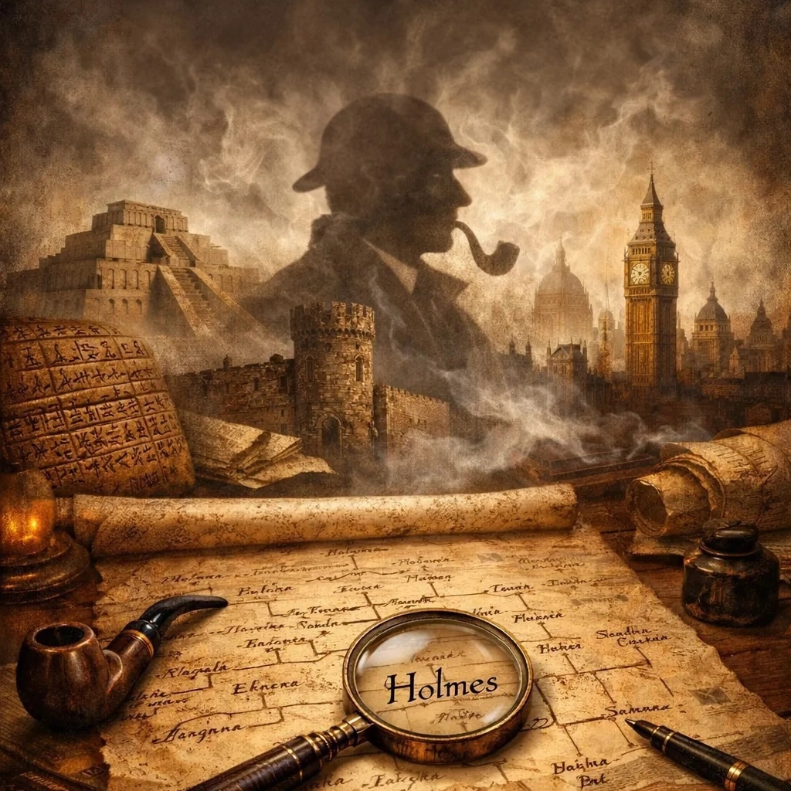

# THE HOLMES CHRONICLE
**∽ 2050 BC - 2026 AD ∼**

One hundred and thirty-one generations across four thousand years — each bearing the same inherited analytical gift, each embedded at the heart of their civilisation, each quietly dismantling the organised criminal networks that persist across every age of human history.

[Read the Chronicle →](https://andreas-breidenthal.github.io/The-Holmes-Chronicle/index.html)

The gift survived the fire. It always did.
From the scribe of Ur to the present day, the same faculty — methodical observation, inference from particulars, the patient dismantling of what ordinary intelligence cannot see — passed from parent to child across one hundred and thirty-one generations, finding in each the form that the age required.
